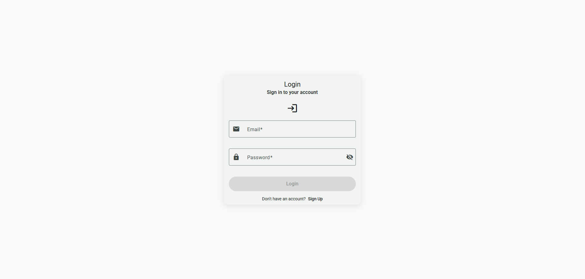
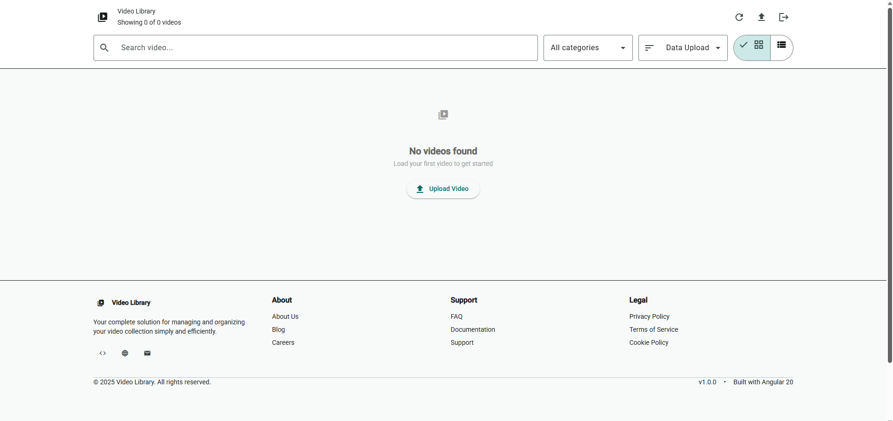
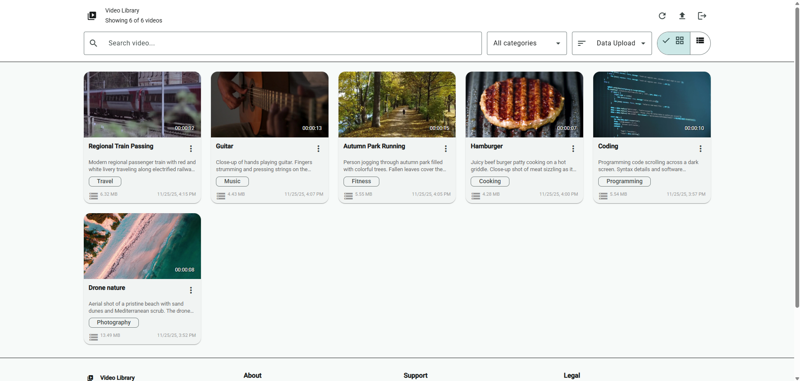
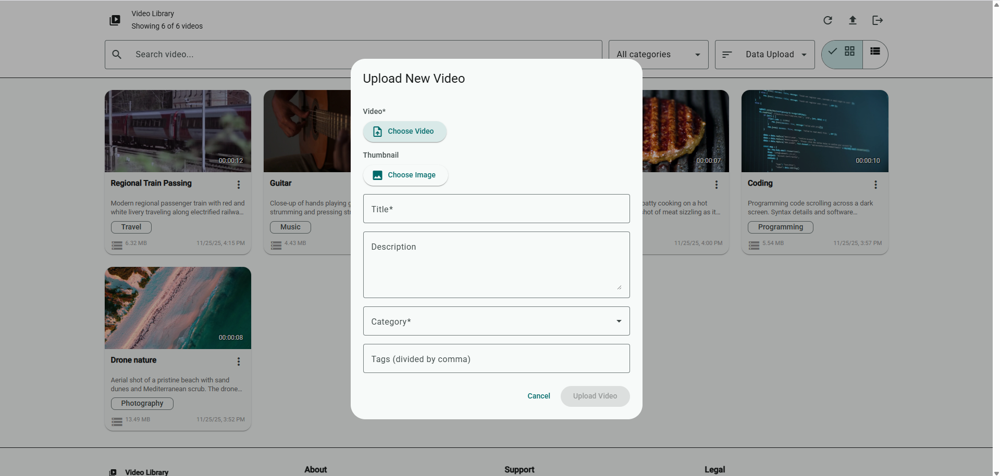
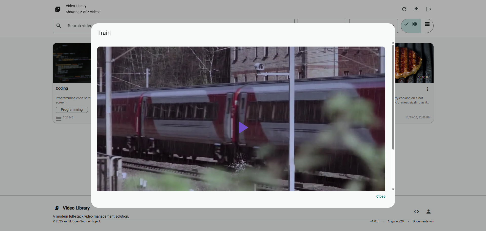

# Remote Video Library – Frontend

[](https://opensource.org/licenses/MIT)

## Description

A modern Angular application for managing and streaming your personal video library remotely. Built with Angular 20, Material Design, and Tailwind CSS, featuring secure authentication, video upload with metadata management, and seamless HLS streaming playback.

> **Note on Architecture:**
> This project was designed as a distributed cloud architecture where the client is public and connects to user-owned private servers. Currently, the project is configured for **self-hosted local deployment** (Localhost), giving you full control over your data and streaming infrastructure.

---

## Screenshots

<table>
  <tr>
    <td>Login Page</td>
    <td>Empty Library State</td>
  </tr>
  <tr>
    <td><a href="screenshots/login.png"></a></td>
    <td><a href="screenshots/empty.png"></a></td>
  </tr>
  <tr>
    <td>Library with Videos</td>
    <td>Upload Interface</td>
  </tr>
  <tr>
    <td><a href="screenshots/library.png"></a></td>
    <td><a href="screenshots/upload.png"></a></td>
  </tr>
  <tr>
    <td>Edit Video</td>
    <td>Video Player</td>
  </tr>
  <tr>
    <td><a href="screenshots/edit.png"></a></td>
    <td><a href="screenshots/player.png"></a></td>
  </tr>
</table>


---

## Features

- 🔐 **User Authentication**: Secure signup/login with JWT
- 📤 **Video Upload**: Custom thumbnails & metadata
- 📝 **Management**: Edit titles, descriptions, tags, categories
- 🎬 **HLS Streaming**: Adaptive bitrate playback with Video.js
- 🔍 **Browse**: Grid/list views with filters
- 🎨 **Modern UI**: Angular Material + Tailwind CSS
- 🔒 **Security**: Protected routes & auth guards

---

## Setup & Installation

### 1. Clone the repository
```
git clone https://github.com/anp3l/remote-video-client.git
cd remote-video-client
```
### 2. Choose your Deployment Method

#### Option A: Docker
The easiest way to run the app. Requires **Docker**.

- Build and start the container
```
docker-compose up --build
```
- App available at: [**http://localhost:4200**](http://localhost:4200)
- Auto-connects to backend (Docker or Local)

Docker Commands Cheat Sheet:
```
#Start (and rebuild if needed)
docker-compose up --build

#Stop containers
docker-compose down

#Full Reset (clean images & volumes)
docker-compose down -v --rmi all
```
#### Option B: Manual Setup
Requires **Node.js v18+** and **Angular CLI v20+**.

1. Install dependencies
```
npm install
```
2. Start the development server:
```
npm start
```
- App available at: [**http://localhost:4200**](http://localhost:4200)
- Live reload enabled for development

---

## Backend Connection

The application automatically detects the correct backend URL based on the environment. 
You can check `src/app/core/config/environment.config.ts`:
```
export const EnvironmentConfig = {
apiBaseUrl: window.location.hostname === 'localhost'
? 'http://localhost:3070' // Local npm backend
: 'http://host.docker.internal:3070', // Docker backend
};
```
---

## Usage Guide

### Authentication
1. Go to [**http://localhost:4200**](http://localhost:4200)
2. **Sign up** to create a new account
3. **Log in** to access your private library

### Managing Videos
- **Upload**: Click the upload button, select video (MP4/MOV/AVI), add metadata
- **Play**: Click any video card to open the HLS streaming player
- **Edit**: Update title, tags, or category anytime
- **Download**: Retrieve original files directly

---

## Project Structure
```
src/
├── app/
│   ├── core/                 # Core application logic
│   │   ├── components/       # Feature components (Login, Library, Player...)
│   │   ├── config/           # App-wide configuration
│   │   ├── guards/           # Route protection guards
│   │   ├── interceptors/     # HTTP interceptors (JWT injection)
│   │   ├── models/           # TypeScript interfaces
│   │   └── services/         # API services & State management
│   ├── shared/               # Reusable UI components & Pipes
│   ├── app.routes.ts         # Application routing
│   └── app.config.ts         # Angular provider configuration
├── index.html                # Entry point
└── main.ts                   # Bootstrap logic
```
---

## Configuration Limits

### Video Upload

Default limits (configurable in `src/app/core/config/environment.config.ts`):

- **Max video size**: 2048 MB (2 GB)
- **Max video duration**: 3600 seconds (1 hour)
- **Supported formats**: MP4, MOV, AVI
- **Max thumbnail size**: 10 MB
- **Supported thumbnail formats**: JPEG, PNG, WebP

### Categories
Available video categories:
- Programming, Photography, Cooking, Fitness, Music, Travel, Business, Other

---

## Tech Stack

- **Angular** 20.3.0
- **Angular Material** 20.2.12
- **Tailwind CSS** 4.1.17
- **Video.js** 8.23.4 (HLS streaming player)
- **Nginx** (Production Server)
- **Docker** (Containerization)

---

## Development

### Build for production
```
npm run build
```
Output will be in `dist/remote-video-client/browser/`

### Serve production build locally

After building, you can serve the production build locally for testing:
```
cd dist/remote-video-client/browser
http-server -p 8080 -c-1 --proxy http://localhost:8080?
```
**Note**: You need to have `http-server` installed globally (`npm install -g http-server`).

The production build will be available at [**http://localhost:8080**](http://localhost:8080)

### Run tests
```
npm test
```
**Note**: Test files (`.spec.ts`) are currently at boilerplate/default state generated by Angular CLI. Custom test implementation is planned for future development.

### Code style

The project uses Prettier for code formatting. Config available in `package.json`.
```
"prettier": {
"printWidth": 100,
"singleQuote": true
}
```
---

## API Integration

This frontend connects to the [Remote Video Library Backend](https://github.com/anp3l/remote-video-server).

- JWT tokens are automatically attached to protected API requests via HTTP interceptor
- Authentication state is managed globally with RxJS BehaviorSubject
- All video operations are per-user isolated (users only see their own videos)
- Backend URL configured in `src/app/core/config/environment.config.ts`

---

## Authentication Flow

1. User signs up or logs in via `/login` or `/signup` routes
2. Backend returns JWT token on successful authentication
3. Token is stored in localStorage
4. Auth interceptor automatically adds token to all API requests
5. Auth guard protects `/library` route from unauthenticated access
6. Token is validated on each request; expired tokens trigger logout

---

## Future Work

- Full-text search across video metadata
- Video playlists and collections
- User profile and settings page
- Video sharing capabilities
- Dark mode theme toggle
- Drag-and-drop upload
- Batch operations (delete multiple videos)
- Complete unit and integration test coverage

---

## License

This project is licensed under the MIT License - see the [LICENSE](LICENSE) file for details.

